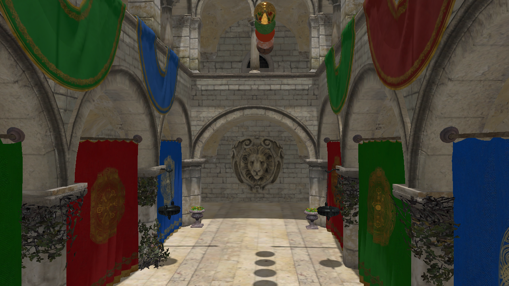

## SponzaPbr

* Scene Features
  * Deferred rendering
  * Physically based rendering
  * Image based lighting
  * Ambient occlusion
    * Raytracing
    * Screen space
  * Normal mapping
  * Point shadow mapping
  * Skeletal animation
  * Multisample anti-aliasing
  * Tone mapping
  * Simple imgui based UI settings



### SponzaPbr Settings
Press Tab to open settings menu

## Build
```
python init.py
mkdir build
cd build
cmake -G "Visual Studio 16 2019" -Ax64 ..
cmake --build . --config RelWithDebInfo
```

## Requirements
* Windows SDK Version 10.0.19041.0
* Vulkan SDK 1.2.162.0 if you build this with VULKAN_SUPPORT=ON (enabled by default)
